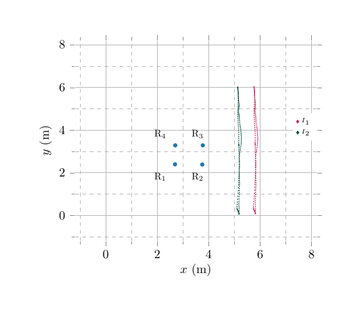

# UWB Relative Localization Dataset

## Case 1
 | 

## Case 2

 | 
 | 
 | 

## Case 3

 |  |  

## Case 4

You can get more information for this case [here](https://arxiv.org/abs/2303.17207)

## Case 5

You can find the rosbags for this case [here](https://utufi.sharepoint.com/:f:/s/msteams_0ed7e9/EgqJcxOKBahPjA9wrD5IezwBQtq_qMV6IInGz1fRkBrVSQ?e=7u23wx).

You can find more information for this case [here](https://arxiv.org/abs/2304.06264)

<!-- # Acknowledgement

Please cite our Dataset paper arxiv if the data in this repo helps your work: -->

